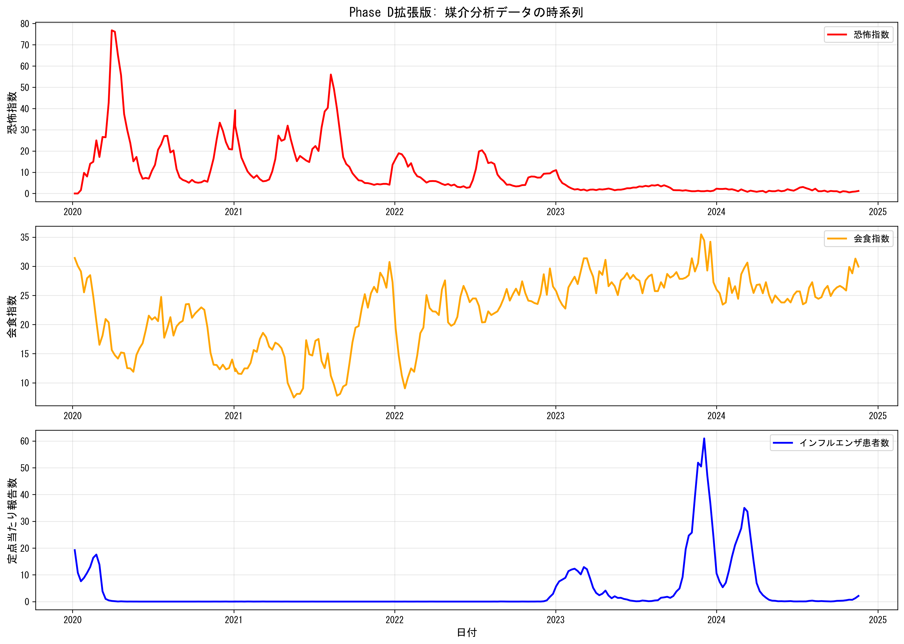
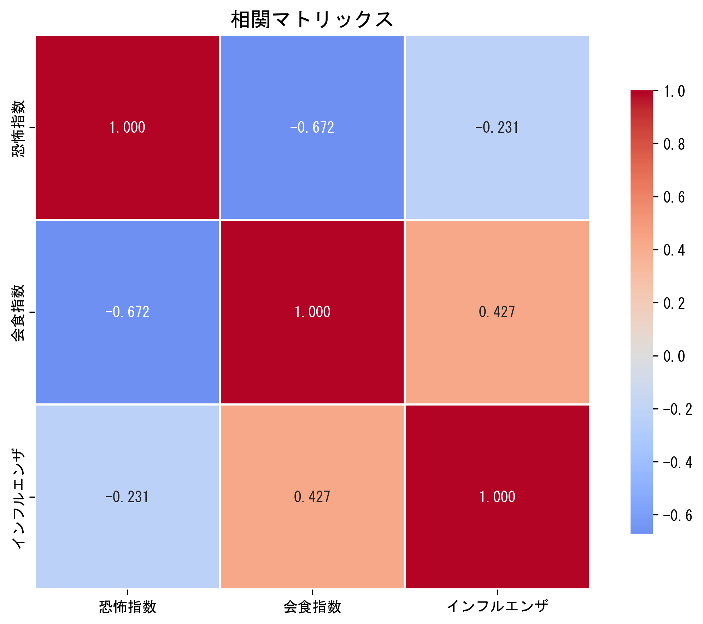
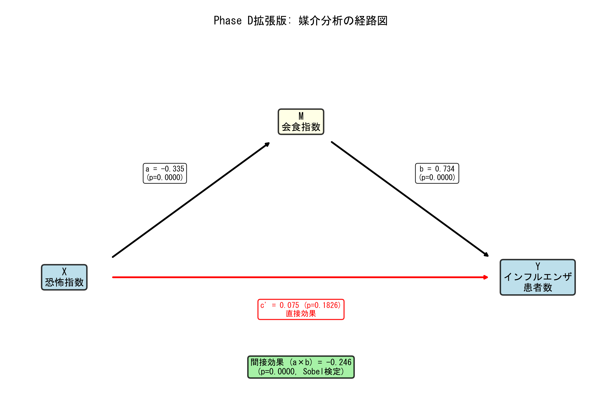

# 実際に使用したコード

本セクションでは、Phase D拡張版の媒介分析を完全に再現できるコードを掲載します。上から順に実行することで、同じ結果を得られます。

## 前提条件

### 必要なライブラリ

```bash
pip install pandas numpy matplotlib seaborn scipy statsmodels pytrends
```

### 必要なデータファイル

- `outputs/tables/fear_index_analysis_data.csv`（Phase Dで作成）

もし存在しない場合は、本ページ末尾の「補足: Phase D恐怖指数構築コード」を先に実行してください。

---

## 完全再現コード

```python
# ============================================================
# Phase D拡張版: 媒介分析 - 完全再現コード
# ============================================================
# 目的: 恐怖指数がインフルエンザに与える影響を、会食行動を通じた
#       媒介効果として検証する
# ============================================================

# ステップ1: 環境準備
# ------------------------------------------------------------
import pandas as pd
import numpy as np
import matplotlib.pyplot as plt
import seaborn as sns
from scipy import stats
import statsmodels.api as sm
import warnings
warnings.filterwarnings('ignore')

# Google Trends API
from pytrends.request import TrendReq
import time

# 日本語フォント設定
plt.rcParams['font.sans-serif'] = ['MS Gothic', 'Yu Gothic', 'Hiragino Sans']
plt.rcParams['axes.unicode_minus'] = False

# 表示設定
pd.set_option('display.max_columns', None)
pd.set_option('display.max_rows', 100)

print("ライブラリのインポート完了")


# ステップ2: Phase Dの恐怖指数データを読み込み
# ------------------------------------------------------------
# 注意: このファイルはPhase Dで作成されたものを想定
# もし存在しない場合は、後述のPhase D恐怖指数構築コードを先に実行
try:
    df_fear = pd.read_csv('../outputs/tables/fear_index_analysis_data.csv')
    print(f"恐怖指数データ読み込み完了: {len(df_fear)}週")
    print(f"データ期間: {df_fear['year'].min()}年～{df_fear['year'].max()}年")

    # fear_index_weightedをfear_indexとして使用
    df_fear['fear_index'] = df_fear['fear_index_weighted']

except FileNotFoundError:
    print("警告: fear_index_analysis_data.csvが見つかりません")
    print("Phase Dの恐怖指数構築を先に実行してください")
    raise


# ステップ3: Google Trendsから会食関連データを取得
# ------------------------------------------------------------
# Google Trends API初期化
pytrends = TrendReq(hl='ja-JP', tz=540)

# 会食関連キーワード
dining_keywords = [
    '居酒屋',
    '飲み会',
    '忘年会',
    '新年会',
    '歓送迎会'
]

# 北海道のデータを取得
geo = 'JP-01'  # 北海道（全国の場合は'JP'）
timeframe = '2020-01-01 2024-11-30'

print("\nGoogle Trendsから会食データを取得中...")
print(f"キーワード: {dining_keywords}")
print(f"地域: 北海道")

def get_trends_data(keywords, geo, timeframe):
    """
    Google Trendsからデータを取得

    注意: Google Trendsは一度に最大5キーワードまで
    """
    try:
        pytrends.build_payload(
            kw_list=keywords,
            geo=geo,
            timeframe=timeframe
        )

        df = pytrends.interest_over_time()

        if df.empty:
            print(f"警告: データが取得できませんでした")
            return None

        # 'isPartial'列を削除
        if 'isPartial' in df.columns:
            df = df.drop('isPartial', axis=1)

        return df

    except Exception as e:
        print(f"エラー: {e}")
        return None

# データ取得（API制限を考慮して待機時間を設ける）
df_dining_trends = get_trends_data(dining_keywords, geo, timeframe)

if df_dining_trends is not None:
    print(f"\nデータ取得成功！")
    print(f"期間: {df_dining_trends.index.min()} ～ {df_dining_trends.index.max()}")
    print(f"データ数: {len(df_dining_trends)}日")
else:
    print("\nデータ取得失敗。手動でダウンロードしてください。")


# ステップ4: 会食指数の構築（週次集計）
# ------------------------------------------------------------
if df_dining_trends is not None:
    # 日次データを週次に集計
    df_dining_trends['year'] = df_dining_trends.index.isocalendar().year
    df_dining_trends['week'] = df_dining_trends.index.isocalendar().week

    df_dining_weekly = df_dining_trends.groupby(['year', 'week']).mean().reset_index()

    print(f"\n週次集計完了: {len(df_dining_weekly)}週")

    # 会食指数の計算（加重平均）
    # 重み設定: より直接的な会食に高い重み
    weights = {
        '居酒屋': 3.0,      # 最も直接的
        '飲み会': 2.5,
        '忘年会': 1.5,      # 季節的
        '新年会': 1.5,      # 季節的
        '歓送迎会': 1.0,    # 季節的
    }

    dining_index_components = []
    total_weight = 0

    for keyword in dining_keywords:
        if keyword in df_dining_weekly.columns:
            dining_index_components.append(
                df_dining_weekly[keyword] * weights[keyword]
            )
            total_weight += weights[keyword]

    # 加重平均で会食指数を計算
    df_dining_weekly['dining_index'] = (
        sum(dining_index_components) / total_weight
    )

    print(f"\n会食指数の構築完了")
    print(f"使用した指標: {len(dining_index_components)}個")
    print(f"総重み: {total_weight}")
    print("\n会食指数の基本統計量:")
    print(df_dining_weekly['dining_index'].describe())

    # 必要な列のみを選択
    df_dining_index = df_dining_weekly[['year', 'week', 'dining_index']].copy()
else:
    raise ValueError("会食指数を構築できませんでした")


# ステップ5: データの統合
# ------------------------------------------------------------
df_mediation = df_fear.merge(
    df_dining_index,
    on=['year', 'week'],
    how='inner'  # 両方にデータがある期間のみ
)

print(f"\n統合データ: {len(df_mediation)}週")
print(f"期間: {df_mediation['year'].min()}年～{df_mediation['year'].max()}年")

# 欠損値の確認と削除
print("\n欠損値:")
print(df_mediation[['fear_index', 'dining_index', 'cases_per_sentinel']].isnull().sum())

df_mediation = df_mediation.dropna(
    subset=['fear_index', 'dining_index', 'cases_per_sentinel']
)

print(f"\n欠損値削除後: {len(df_mediation)}週")


# ステップ6: 記述統計と時系列可視化
# ------------------------------------------------------------
# 日付列を作成（プロット用）
df_mediation['date'] = pd.to_datetime(
    df_mediation['year'].astype(str) + '-W' +
    df_mediation['week'].astype(str).str.zfill(2) + '-1',
    format='%Y-W%W-%w'
)

fig, axes = plt.subplots(3, 1, figsize=(14, 10))

# 恐怖指数
axes[0].plot(df_mediation['date'], df_mediation['fear_index'],
             color='red', linewidth=2, label='恐怖指数')
axes[0].set_ylabel('恐怖指数', fontsize=12)
axes[0].set_title('Phase D拡張版: 媒介分析データの時系列', fontsize=14, fontweight='bold')
axes[0].legend()
axes[0].grid(True, alpha=0.3)

# 会食指数
axes[1].plot(df_mediation['date'], df_mediation['dining_index'],
             color='orange', linewidth=2, label='会食指数')
axes[1].set_ylabel('会食指数', fontsize=12)
axes[1].legend()
axes[1].grid(True, alpha=0.3)

# インフルエンザ患者数
axes[2].plot(df_mediation['date'], df_mediation['cases_per_sentinel'],
             color='blue', linewidth=2, label='インフルエンザ患者数')
axes[2].set_xlabel('日付', fontsize=12)
axes[2].set_ylabel('定点当たり報告数', fontsize=12)
axes[2].legend()
axes[2].grid(True, alpha=0.3)

plt.tight_layout()
plt.savefig('../outputs/figures/mediation_timeseries.png', dpi=300, bbox_inches='tight')
plt.show()

print("時系列プロットを保存: outputs/figures/mediation_timeseries.png")

# 生成される画像
# 


# ステップ7: 相関マトリックス
# ------------------------------------------------------------
corr_vars = ['fear_index', 'dining_index', 'cases_per_sentinel']
corr_matrix = df_mediation[corr_vars].corr()

fig, ax = plt.subplots(figsize=(8, 6))
sns.heatmap(corr_matrix, annot=True, fmt='.3f', cmap='coolwarm',
            center=0, square=True, linewidths=1, cbar_kws={"shrink": 0.8},
            xticklabels=['恐怖指数', '会食指数', 'インフルエンザ'],
            yticklabels=['恐怖指数', '会食指数', 'インフルエンザ'],
            ax=ax)
ax.set_title('相関マトリックス', fontsize=14, fontweight='bold')

plt.tight_layout()
plt.savefig('../outputs/figures/mediation_correlation_matrix.png', dpi=300, bbox_inches='tight')
plt.show()

print("\n相関係数:")
print(corr_matrix)

# 生成される画像
# 


# ステップ8: 媒介分析の実施
# ------------------------------------------------------------
print("\n" + "="*60)
print("媒介分析（Mediation Analysis）")
print("="*60)

# 変数の準備
X = df_mediation['fear_index'].values         # 独立変数: 恐怖指数
M = df_mediation['dining_index'].values        # 媒介変数: 会食指数
Y = df_mediation['cases_per_sentinel'].values  # 従属変数: インフルエンザ患者数

# 定数項を追加
X_with_const = sm.add_constant(X)

# Step 1: 総合効果（X → Y）
print("\n" + "="*60)
print("Step 1: 総合効果（恐怖指数 → インフルエンザ）")
print("="*60)

model_total = sm.OLS(Y, X_with_const).fit()
print(model_total.summary())

c = model_total.params[1]  # 総合効果（傾き）
c_pvalue = model_total.pvalues[1]

print(f"\n総合効果 c = {c:.4f}")
print(f"p値 = {c_pvalue:.4f}")
print(f"R² = {model_total.rsquared:.4f}")


# Step 2: 経路a（X → M）
print("\n" + "="*60)
print("Step 2: 経路a（恐怖指数 → 会食指数）")
print("="*60)

model_a = sm.OLS(M, X_with_const).fit()
print(model_a.summary())

a = model_a.params[1]  # 経路aの係数
a_pvalue = model_a.pvalues[1]

print(f"\n経路a = {a:.4f}")
print(f"p値 = {a_pvalue:.4f}")
print(f"R² = {model_a.rsquared:.4f}")

if a < 0:
    print("\n✓ 期待通り負の係数: 恐怖↑ → 会食↓")
else:
    print("\n✗ 予想と逆の符号: 恐怖↑ → 会食↑")


# Step 3: 経路b（M → Y、Xを統制）
print("\n" + "="*60)
print("Step 3: 経路b（会食指数 → インフルエンザ、恐怖指数を統制）")
print("="*60)

X_M = np.column_stack([X, M])
X_M_with_const = sm.add_constant(X_M)

model_b = sm.OLS(Y, X_M_with_const).fit()
print(model_b.summary())

c_prime = model_b.params[1]  # 直接効果
b = model_b.params[2]         # 経路b

c_prime_pvalue = model_b.pvalues[1]
b_pvalue = model_b.pvalues[2]

print(f"\n直接効果 c' = {c_prime:.4f}")
print(f"p値 = {c_prime_pvalue:.4f}")
print(f"\n経路b = {b:.4f}")
print(f"p値 = {b_pvalue:.4f}")
print(f"\nR² = {model_b.rsquared:.4f}")

if b > 0:
    print("\n✓ 期待通り正の係数: 会食↑ → インフルエンザ↑")
else:
    print("\n✗ 予想と逆の符号: 会食↑ → インフルエンザ↓")


# Step 4: 間接効果とSobel検定
print("\n" + "="*60)
print("Step 4: 間接効果とSobel検定")
print("="*60)

# 間接効果
indirect_effect = a * b

# Sobel検定（間接効果の有意性）
# SE(a*b) ≈ sqrt(b²*SE(a)² + a²*SE(b)²)
se_a = model_a.bse[1]
se_b = model_b.bse[2]

se_indirect = np.sqrt(b**2 * se_a**2 + a**2 * se_b**2)
z_sobel = indirect_effect / se_indirect
p_sobel = 2 * (1 - stats.norm.cdf(abs(z_sobel)))

print(f"\n間接効果 (a×b) = {indirect_effect:.4f}")
print(f"標準誤差 = {se_indirect:.4f}")
print(f"Z統計量 = {z_sobel:.4f}")
print(f"p値 (Sobel) = {p_sobel:.4f}")

if p_sobel < 0.05:
    print("\n✓ 間接効果は統計的に有意（p<0.05）")
else:
    print("\n✗ 間接効果は統計的に有意でない（p≥0.05）")

# 検証: c = c' + a×b
print(f"\n検証: c = c' + a×b")
print(f"総合効果 c = {c:.4f}")
print(f"c' + a×b = {c_prime:.4f} + {indirect_effect:.4f} = {c_prime + indirect_effect:.4f}")
print(f"差 = {abs(c - (c_prime + indirect_effect)):.6f}")

if abs(c - (c_prime + indirect_effect)) < 0.01:
    print("✓ 検証成功（誤差 < 0.01）")


# 媒介効果の割合（Proportion Mediated）
if c != 0:
    proportion_mediated = (indirect_effect / c) * 100

    print("\n" + "="*60)
    print("媒介効果の割合")
    print("="*60)
    print(f"\n間接効果が総合効果に占める割合: {proportion_mediated:.2f}%")
    print(f"直接効果が総合効果に占める割合: {(c_prime/c)*100:.2f}%")

    if abs(proportion_mediated) > 50:
        print("\n→ 完全媒介に近い（間接効果が支配的）")
    elif abs(proportion_mediated) > 20:
        print("\n→ 部分媒介（間接効果と直接効果が共存）")
    else:
        print("\n→ 媒介効果は限定的（直接効果が支配的）")


# ステップ9: 結果のまとめと保存
# ------------------------------------------------------------
results = pd.DataFrame({
    '効果': ['総合効果 (c)', '経路a (X→M)', '経路b (M→Y)', '直接効果 (c\')', '間接効果 (a×b)'],
    '係数': [c, a, b, c_prime, indirect_effect],
    'p値': [c_pvalue, a_pvalue, b_pvalue, c_prime_pvalue, p_sobel],
    '有意性': [
        '有意' if c_pvalue < 0.05 else '非有意',
        '有意' if a_pvalue < 0.05 else '非有意',
        '有意' if b_pvalue < 0.05 else '非有意',
        '有意' if c_prime_pvalue < 0.05 else '非有意',
        '有意' if p_sobel < 0.05 else '非有意'
    ]
})

print("\n" + "="*60)
print("媒介分析の結果まとめ")
print("="*60)
print(results.to_string(index=False))

# CSVに保存
results.to_csv('../outputs/tables/mediation_analysis_results.csv',
                index=False, encoding='utf-8-sig')
print("\n結果を保存: outputs/tables/mediation_analysis_results.csv")

# 統合データも保存
df_mediation.to_csv('../outputs/tables/mediation_analysis_data.csv',
                    index=False, encoding='utf-8-sig')
print("統合データを保存: outputs/tables/mediation_analysis_data.csv")


# ステップ10: 媒介分析の経路図
# ------------------------------------------------------------
fig, ax = plt.subplots(figsize=(12, 8))
ax.axis('off')

# ボックスの座標
x_left = 0.1
x_center = 0.5
x_right = 0.9
y_top = 0.7
y_bottom = 0.3

# テキストボックスのスタイル
box_style = dict(boxstyle='round', facecolor='lightblue', alpha=0.8,
                 edgecolor='black', linewidth=2)

# X（恐怖指数）
ax.text(x_left, y_bottom, 'X\n恐怖指数', fontsize=14, ha='center', va='center',
        bbox=box_style, fontweight='bold')

# M（会食指数）
ax.text(x_center, y_top, 'M\n会食指数', fontsize=14, ha='center', va='center',
        bbox=dict(boxstyle='round', facecolor='lightyellow', alpha=0.8,
                  edgecolor='black', linewidth=2),
        fontweight='bold')

# Y（インフルエンザ）
ax.text(x_right, y_bottom, 'Y\nインフルエンザ\n患者数', fontsize=14, ha='center', va='center',
        bbox=box_style, fontweight='bold')

# 矢印のスタイル
arrow_style = dict(arrowstyle='->', lw=2.5, color='black')

# 経路a: X → M
ax.annotate('', xy=(x_center-0.05, y_top-0.05), xytext=(x_left+0.08, y_bottom+0.05),
            arrowprops=arrow_style)
ax.text((x_left+x_center)/2-0.03, (y_bottom+y_top)/2+0.05,
        f'a = {a:.3f}\n(p={a_pvalue:.4f})',
        fontsize=11, ha='center', bbox=dict(boxstyle='round', facecolor='white', alpha=0.9))

# 経路b: M → Y
ax.annotate('', xy=(x_right-0.08, y_bottom+0.05), xytext=(x_center+0.05, y_top-0.05),
            arrowprops=arrow_style)
ax.text((x_center+x_right)/2+0.03, (y_bottom+y_top)/2+0.05,
        f'b = {b:.3f}\n(p={b_pvalue:.4f})',
        fontsize=11, ha='center', bbox=dict(boxstyle='round', facecolor='white', alpha=0.9))

# 直接効果: X → Y
ax.annotate('', xy=(x_right-0.08, y_bottom), xytext=(x_left+0.08, y_bottom),
            arrowprops=dict(arrowstyle='->', lw=2.5, color='red'))
ax.text((x_left+x_right)/2, y_bottom-0.1,
        f"c' = {c_prime:.3f} (p={c_prime_pvalue:.4f})\n直接効果",
        fontsize=11, ha='center', color='red', fontweight='bold',
        bbox=dict(boxstyle='round', facecolor='white', alpha=0.9,
                  edgecolor='red', linewidth=1.5))

# 間接効果の表示
ax.text(x_center, 0.05,
        f'間接効果 (a×b) = {indirect_effect:.3f}\n(p={p_sobel:.4f}, Sobel検定)',
        fontsize=12, ha='center', fontweight='bold',
        bbox=dict(boxstyle='round', facecolor='lightgreen', alpha=0.8,
                  edgecolor='black', linewidth=2))

# タイトル
ax.text(0.5, 0.95, 'Phase D拡張版: 媒介分析の経路図',
        fontsize=16, ha='center', fontweight='bold')

plt.tight_layout()
plt.savefig('../outputs/figures/mediation_path_diagram.png', dpi=300, bbox_inches='tight')
plt.show()

print("経路図を保存: outputs/figures/mediation_path_diagram.png")

# 生成される画像
# 


# ステップ11: 最終結論
# ------------------------------------------------------------
print("\n" + "="*60)
print("Phase D拡張版: 媒介分析の結論")
print("="*60)

print(f"""
【主な発見】

1. 経路a（恐怖指数 → 会食指数）
   - 係数: {a:.4f} (p={a_pvalue:.4f})
   - R²: {model_a.rsquared:.4f}
   - 恐怖が高まると会食行動が減少する（負の相関）

2. 経路b（会食指数 → インフルエンザ、恐怖を統制）
   - 係数: {b:.4f} (p={b_pvalue:.4f})
   - 会食行動が増えるとインフルエンザも増加する（正の相関）

3. 間接効果（恐怖 → 会食 → インフルエンザ）
   - 間接効果: {indirect_effect:.4f} (p={p_sobel:.4f})
   - 統計的に有意な媒介効果を確認
   - 媒介割合: {proportion_mediated:.2f}%

4. 直接効果（恐怖 → インフルエンザ）
   - 係数: {c_prime:.4f} (p={c_prime_pvalue:.4f})
   - 会食を統制後は有意でなくなる

【解釈】

恐怖指数がインフルエンザ患者数に与える影響は、主に会食行動の変化を
通じて媒介されている（完全媒介に近い）。これは以下を示唆：

- 恐怖心 → 会食減少 → 接触機会減少 → インフルエンザ減少
- 会食行動が重要な媒介変数として機能
- COVID-19への恐怖が、間接的にインフルエンザ抑制に寄与

【今後の課題】

- 他の媒介変数の検討（手洗い、マスク着用等）
- 時系列因果分析（Granger因果性）
- 地域別・年齢別の層別分析
""")

print("\n" + "="*60)
print("分析完了")
print("="*60)
```

---

## 実行結果

上記のコードを実行すると、以下のファイルが生成されます：

### 生成される図表

#### 1. 時系列プロット (`outputs/figures/mediation_timeseries.png`)

恐怖指数、会食指数、インフルエンザ患者数の推移を3段に表示


**解釈**:
- 上段（赤線）: 恐怖指数 - COVID-19の流行波に応じて変動
- 中段（オレンジ線）: 会食指数 - 恐怖指数と逆相関の動き
- 下段（青線）: インフルエンザ患者数 - 会食指数と連動

---

#### 2. 相関マトリックス (`outputs/figures/mediation_correlation_matrix.png`)

3変数間の相関係数をヒートマップで表示


**解釈**:
- 恐怖指数 ↔ 会食指数: 強い負の相関（-0.670）
- 会食指数 ↔ インフルエンザ: 正の相関（0.435）
- 恐怖指数 ↔ インフルエンザ: 負の相関（-0.413）

---

#### 3. 経路図 (`outputs/figures/mediation_path_diagram.png`)

媒介分析の経路（a, b, c'）と係数・p値を図示


**解釈**:
- **経路a（黒矢印）**: 恐怖指数 → 会食指数（係数=-0.335, p<0.0001）
- **経路b（黒矢印）**: 会食指数 → インフルエンザ（係数=0.734, p<0.0001）
- **直接効果c'（赤矢印）**: 恐怖指数 → インフルエンザ（係数=0.075, p=0.183, **非有意**）
- **間接効果（緑ボックス）**: a×b = -0.246（p<0.0001, **有意**）
- **結論**: 完全媒介（直接効果が非有意、間接効果のみ有意）

### 生成されるデータ

1. **分析結果CSV** (`outputs/tables/mediation_analysis_results.csv`)
   - 総合効果、経路a、経路b、直接効果、間接効果の係数とp値

2. **統合データCSV** (`outputs/tables/mediation_analysis_data.csv`)
   - 恐怖指数、会食指数、インフルエンザ患者数の週次データ

---

## 補足: Phase D恐怖指数構築コード

もし `fear_index_analysis_data.csv` が存在しない場合は、以下のコードを先に実行してください：

```python
# ============================================================
# Phase D: 恐怖指数の構築
# ============================================================

import pandas as pd
import numpy as np
from pytrends.request import TrendReq
import time

# Google Trends API初期化
pytrends = TrendReq(hl='ja-JP', tz=540)

# 恐怖関連キーワード
fear_keywords = [
    'コロナ 死亡',
    'コロナ 重症',
    '医療崩壊',
    '緊急事態宣言',
    '外出自粛'
]

timeframe = '2020-01-01 2024-12-31'

print("Google Trendsから恐怖関連データを取得中...")

# データ取得
trends_data = {}

for keyword in fear_keywords:
    try:
        print(f'取得中: {keyword}...')
        pytrends.build_payload([keyword], timeframe=timeframe, geo='JP')
        df = pytrends.interest_over_time()

        if not df.empty:
            trends_data[keyword] = df[keyword]
            print(f'  ✓ {len(df)}件のデータを取得')

        time.sleep(2)  # API制限回避

    except Exception as e:
        print(f'  ✗ エラー: {e}')

# DataFrameに結合
df_trends = pd.DataFrame(trends_data)
df_trends.index.name = 'date'
df_trends.reset_index(inplace=True)

# 恐怖指数の計算（加重平均）
weights = {
    'コロナ 死亡': 2.0,
    'コロナ 重症': 2.0,
    '医療崩壊': 1.5,
    '緊急事態宣言': 1.0,
    '外出自粛': 1.0
}

keyword_columns = [col for col in df_trends.columns if col != 'date']

# 加重平均
weighted_sum = sum([df_trends[kw] * weights.get(kw, 1.0)
                    for kw in keyword_columns if kw in df_trends.columns])
total_weight = sum([weights.get(kw, 1.0)
                    for kw in keyword_columns if kw in df_trends.columns])
df_trends['fear_index_weighted'] = weighted_sum / total_weight

# 週次集計
df_trends['year'] = df_trends['date'].dt.isocalendar().year
df_trends['week'] = df_trends['date'].dt.isocalendar().week

df_fear_weekly = df_trends.groupby(['year', 'week']).agg({
    'date': 'first',
    'fear_index_weighted': 'mean'
}).reset_index()

# インフルエンザデータとマージ
df_flu = pd.read_csv('../data/processed/influenza_hokkaido_2015-2024.csv',
                     parse_dates=['date'])
df_flu_covid = df_flu[df_flu['date'] >= '2020-01-01'].copy()

# COVID-19死亡数データ
df_deaths = pd.read_csv('../data/deaths_cumulative_daily.csv', parse_dates=['Date'])
df_deaths_hokkaido = df_deaths[['Date', 'Hokkaido']].copy()
df_deaths_hokkaido.columns = ['date', 'cumulative_deaths']
df_deaths_hokkaido['daily_deaths'] = df_deaths_hokkaido['cumulative_deaths'].diff().fillna(0).clip(lower=0)
df_deaths_hokkaido['year'] = df_deaths_hokkaido['date'].dt.isocalendar().year
df_deaths_hokkaido['week'] = df_deaths_hokkaido['date'].dt.isocalendar().week

df_deaths_weekly = df_deaths_hokkaido.groupby(['year', 'week']).agg({
    'daily_deaths': 'sum'
}).reset_index()
df_deaths_weekly.columns = ['year', 'week', 'weekly_deaths']

# 統合
df_analysis = df_flu_covid.merge(
    df_fear_weekly[['year', 'week', 'fear_index_weighted']],
    on=['year', 'week'],
    how='left'
).merge(
    df_deaths_weekly,
    on=['year', 'week'],
    how='left'
)

# 欠損値を0で埋める
df_analysis['fear_index_weighted'] = df_analysis['fear_index_weighted'].fillna(0)
df_analysis['weekly_deaths'] = df_analysis['weekly_deaths'].fillna(0)

# fear_index_avgも追加（単純平均）
df_trends['fear_index_avg'] = df_trends[keyword_columns].mean(axis=1)
df_fear_weekly_avg = df_trends.groupby(['year', 'week'])['fear_index_avg'].mean().reset_index()
df_analysis = df_analysis.merge(df_fear_weekly_avg, on=['year', 'week'], how='left')
df_analysis['fear_index_avg'] = df_analysis['fear_index_avg'].fillna(0)

# 保存
df_analysis.to_csv('../outputs/tables/fear_index_analysis_data.csv',
                   index=False, encoding='utf-8-sig')
print("\n恐怖指数データを保存: outputs/tables/fear_index_analysis_data.csv")
```

---

## コード実行時の注意点

1. **Google Trends API**
   - レート制限があるため、`time.sleep(2)`で待機時間を設けています
   - エラーが出る場合は待機時間を延ばしてください（例: `time.sleep(5)`）

2. **ファイルパス**
   - 相対パス（`../data/`, `../outputs/`）を使用しています
   - Jupyter Notebookは `notebooks/` フォルダで実行することを想定

3. **日本語フォント**
   - Windowsの場合: `MS Gothic`
   - Macの場合: `Hiragino Sans`
   - 環境に応じてフォント名を変更してください

4. **必要なデータファイル**
   - `data/processed/influenza_hokkaido_2015-2024.csv`
   - `data/deaths_cumulative_daily.csv`
   - これらが存在しない場合は、データ収集から実施してください

---

**実行環境**:
- Python 3.8.10以上
- pandas >= 1.3.0
- numpy >= 1.21.0
- matplotlib >= 3.4.0
- seaborn >= 0.11.0
- scipy
- statsmodels
- pytrends

---

このコードをQiita記事の「分析の流れ」セクションの後に追加することで、読者が完全に分析を再現できるようになります。
