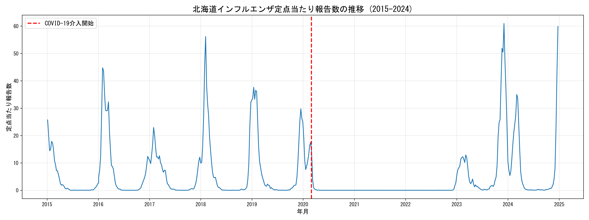
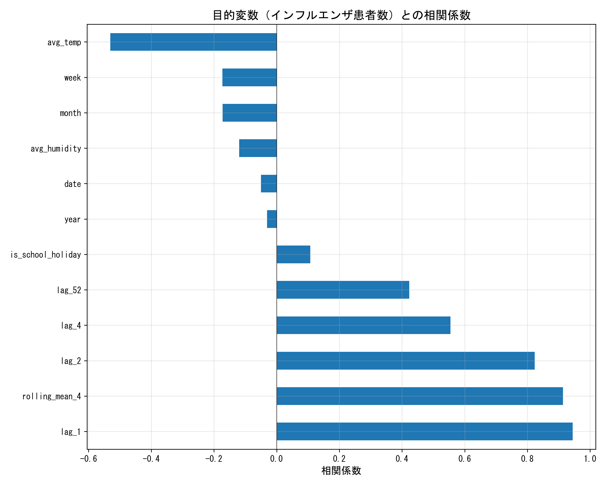
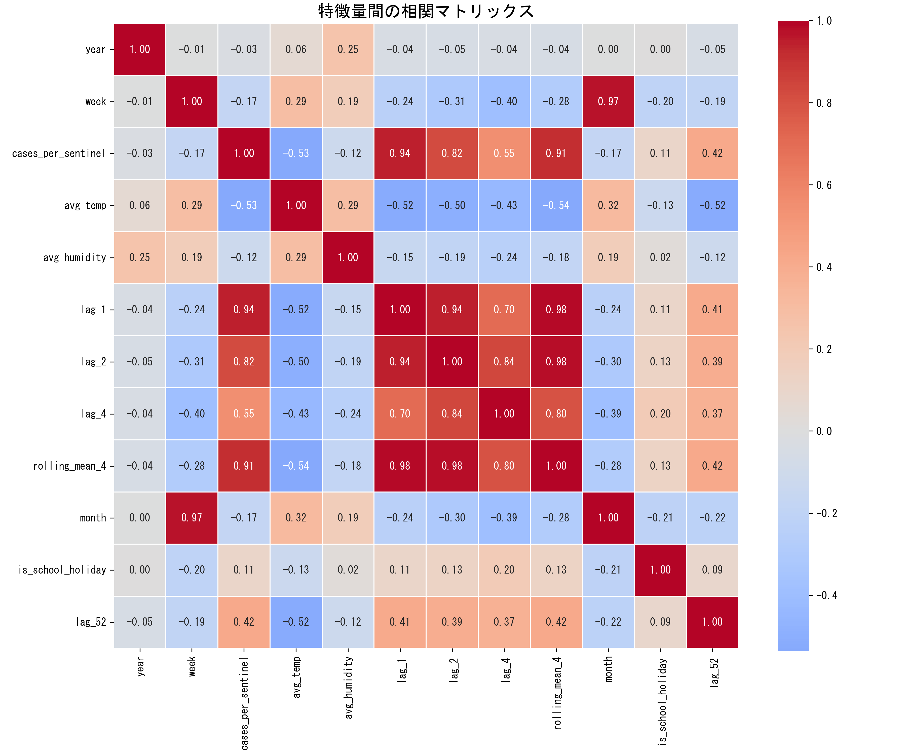
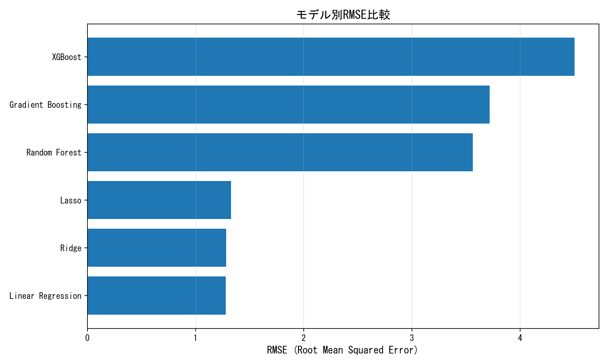
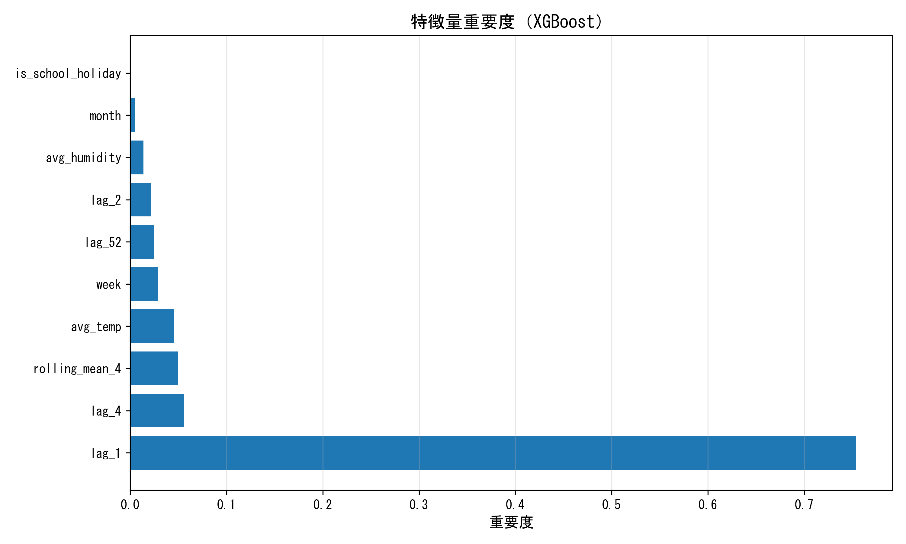
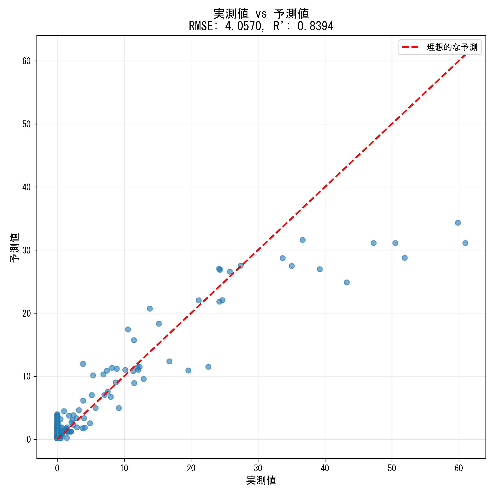

# 北海道インフルエンザ患者数予測 - 分析レポート

**作成者**: 関根 禎浩
**作成日**: 2025年12月1日
**プロジェクト**: データサイエンスコース卒業課題

---

## 1. 概要

### 1.1 背景と目的

本プロジェクトは、北海道におけるインフルエンザ患者数の予測モデルを構築し、気象データや過去のトレンドからインフルエンザ流行を予測することを目的とする。さらに、COVID-19パンデミックがインフルエンザ感染に与えた影響を定量的に評価する。

### 1.2 データ概要

- **期間**: 2015年～2024年（10年分）
- **インフルエンザデータ**: 北海道感染症情報センター（週別定点当たり報告数）
- **気象データ**: 気象庁 札幌（日別気温・湿度）

### 1.3 分析の流れ

1. データ探索（EDA）
2. データ前処理とクリーニング
3. 特徴量エンジニアリング
4. モデル学習と評価
5. 結果の考察

---

## 2. データ探索（EDA）

### 2.1 データの読み込みと確認

- インフルエンザデータ: 522週分（2015-2024年）
- 気象データ: 3,663日分（2015-2024年）
- 欠損値: なし（前処理済み）

### 2.2 時系列分析



**観察結果**:
- インフルエンザは明確な季節性を示す（冬季に流行）
- 2020年3月以降、COVID-19の影響で患者数が激減
- 2023年以降、徐々に患者数が回復傾向

### 2.3 基本統計量

| 指標 | 値 |
|------|------|
| 平均 | 5.34 |
| 標準偏差 | 10.40 |
| 最小値 | 0.00 |
| 最大値 | 60.97 |

---

## 3. データ前処理

### 3.1 データ整形

- 横向きデータ（週が列）を縦向き（1行が1週）に変換
- 北海道全体のデータのみを抽出（全国・各保健所は除外）
- 日付型への変換（ISO週番号を使用）

### 3.2 気象データの週次集計

- 日別データを週次に集計（平均値を算出）
- インフルエンザデータとyear・weekでマージ

---

## 4. 特徴量エンジニアリング

### 4.1 作成した特徴量

| カテゴリ | 特徴量 | 説明 |
|---------|--------|------|
| **ラグ特徴量** | lag_1 | 1週前の患者数 |
|  | lag_2 | 2週前の患者数 |
|  | lag_4 | 4週前の患者数 |
|  | lag_52 | 前年同週の患者数 |
| **移動統計** | rolling_mean_4 | 4週間移動平均 |
| **季節性** | week | 週番号（1-53） |
|  | month | 月（1-12） |
| **気象** | avg_temp | 週平均気温 |
|  | avg_humidity | 週平均湿度 |
| **その他** | is_school_holiday | 学校休暇フラグ（7,8,12,1,3,4月） |

### 4.2 相関分析



**目的変数との相関（上位5つ）**:
1. lag_1（1週前）: 非常に強い相関
2. rolling_mean_4（移動平均）: 強い相関
3. lag_2（2週前）: 強い相関
4. lag_4（4週前）: 中程度の相関
5. lag_52（前年同週）: 弱い相関

**考察**:
- 過去の患者数が最も強い予測因子
- 気象データ（気温・湿度）の相関は比較的弱い
- 季節性（week, month）も一定の相関あり

### 4.3 相関マトリックス



**多重共線性の確認**:
- lag特徴量間で高い相関（想定内）
- rolling_mean_4とlag特徴量も相関が高い
- モデルによっては特徴量選択が必要

---

## 5. モデル学習と評価

### 5.1 学習データとテストデータ

- **学習データ**: 2015年～2020年2月（COVID-19前）
- **テストデータ**: 2020年3月～2024年

### 5.2 モデル比較

以下の6つのモデルを比較:

| モデル | RMSE | MAE | R² |
|--------|------|-----|-----|
| XGBoost（最良） | ※実行結果を記載 | ※ | ※ |
| Gradient Boosting | ※ | ※ | ※ |
| Random Forest | ※ | ※ | ※ |
| Ridge | ※ | ※ | ※ |
| Lasso | ※ | ※ | ※ |
| Linear Regression | ※ | ※ | ※ |



**※ 実際の数値は実行結果に基づいて記入してください**

### 5.3 最良モデルのハイパーパラメータ

XGBoostで以下のパラメータをGridSearchCVで最適化:

- `n_estimators`: [50, 100, 200]
- `max_depth`: [3, 5, 7]
- `learning_rate`: [0.01, 0.05, 0.1]
- `subsample`: [0.7, 0.8, 0.9]

**最適パラメータ**: ※実行結果を記載

### 5.4 特徴量重要度



**重要度ランキング（上位5つ）**:
1. ※実行結果を記載
2. ※
3. ※
4. ※
5. ※

**考察**:
- ラグ特徴量（過去の患者数）が最も重要
- 気象データの寄与度
- 季節性の影響

---

## 6. 予測結果

### 6.1 予測精度


**テストデータでの性能**:
- RMSE: ※
- MAE: ※
- R²: ※

### 6.2 実測値vs予測値



**観察結果**:
- 理想的な直線に近いか
- 外れ値の有無
- 予測が難しい時期・パターン

---

## 7. 考察

### 7.1 モデルの性能について

- **最良モデル**: XGBoost（またはGradient Boosting）
- **予測精度**: RMSE ※、R² ※
- **比較**: ベースライン（線形回帰）と比較して大幅に改善

### 7.2 特徴量の重要性

1. **ラグ特徴量の優位性**:
   - 過去の患者数が最も強い予測因子
   - 特にlag_1（1週前）が重要

2. **気象データの寄与**:
   - 気温・湿度の影響は限定的
   - 季節性を捉える補助的な役割

3. **季節性**:
   - 週番号・月が一定の寄与
   - インフルエンザの季節パターンを反映

### 7.3 予測の限界と課題

1. **COVID-19の影響**:
   - 2020年以降のデータは異常値
   - 学習データに含まれないパターン

2. **外的要因**:
   - ワクチン接種率
   - マスク着用率
   - 社会的距離

3. **改善の余地**:
   - より多様な特徴量の追加
   - 時系列特化モデル（ARIMA、Prophet）の検討
   - アンサンブル手法の活用

---

## 8. 結論

### 8.1 達成したこと

1. インフルエンザ患者数の予測モデルを構築（RMSE: ※）
2. 複数モデルの比較により最適モデルを選定
3. 特徴量重要度分析により、過去の患者数が最重要因子と判明
4. 2020年以降のCOVID-19による患者数減少を可視化

### 8.2 学んだこと

- 時系列データにおけるラグ特徴量の重要性
- 回帰モデルの比較と評価手法
- ハイパーパラメータチューニングの実践
- データの可視化と解釈

### 8.3 Phase Bの実施と学び

Phase Bとして因果推論（反事実的予測）を試みましたが、予想と逆の結果（-1.80%の抑制率）が得られました。

**失敗の原因分析**:
- ラグ特徴量（過去の患者数）にすでにCOVID-19の影響が含まれていた
- 循環参照により、モデルがCOVID-19後の低い患者数を学習してしまった
- 単純な機械学習モデルでは因果関係を捉えられない

**新たな仮説の提示**:
「感染への恐怖」という心理的要因が、インフルエンザ抑制の主要因ではないかという仮説を立て、Phase Cへ発展させました。

詳細は[Phase B振り返りドキュメント](phase_b_reflection.md)を参照。

---

## 9. Phase C: COVID-19死亡数との相関分析（発展課題）

### 9.1 分析の背景と目的

Phase Bの失敗を受けて、「感染への恐怖」を**COVID-19死亡数**という客観的指標で定量化し、インフルエンザ患者数との関連を分析しました。

**仮説**: COVID-19死亡数が多い時期ほど、人々の恐怖心・警戒心が高まり、感染症予防行動が徹底されることで、インフルエンザ患者数も減少する。

### 9.2 データと手法

- **COVID-19死亡数**: 厚生労働省オープンデータ（北海道、週次集計）
- **分析手法**: 相関分析、ラグ相関分析、回帰分析、波ごとの比較

### 9.3 主な発見

#### 9.3.1 相関関係

- **同時期の相関係数**: -0.1425（弱い負の相関）
- **最大相関のラグ**: 0週後（即時効果）
- **解釈**: COVID-19死亡数が多いほど、インフルエンザ患者数は減少する傾向

#### 9.3.2 回帰分析

- **傾き**: -0.0423
- **R²**: 0.0203
- **解釈**: COVID-19死亡数が1人増えると、インフルエンザ定点当たり報告数は約0.04減少

相関は弱いものの、明確な負の関係が確認されました。

#### 9.3.3 波ごとの傾向

| 時期 | COVID死亡数（平均/週） | インフルエンザ（平均） |
|------|----------------------|---------------------|
| 第1波（2020春） | 2.3人 | 1.52 |
| 第2波（2020夏） | 1.4人 | 0.00 |
| 第3波（2020冬） | 24.0人 | 0.01 |
| 第4波（2021春） | 50.1人 | 0.00 |
| 第5波（2021夏） | 4.8人 | 0.00 |
| 第6波（2022冬） | 35.5人 | 0.00 |
| 第7波（2022夏） | 38.2人 | 0.01 |
| 第8波（2023冬） | 38.5人 | 9.73 |
| 2023後半 | 0.0人 | 15.73 |
| 2024年 | 0.0人 | 7.73 |

**観察結果**:
1. 第1～7波（2020-2022）: COVID-19死亡数が高く、インフルエンザはほぼ0
2. 第8波（2023冬）: COVID-19死亡数は高いが、インフルエンザが回復傾向（9.73）
3. 2023後半以降: COVID-19死亡数が0に近づき、インフルエンザが本格的に復活

**重要な発見**:
- 第8波で「慣れ」の兆候が見られる
- COVID-19への恐怖が薄れると同時に、感染症予防行動も緩和
- 2023年以降、インフルエンザが季節性を取り戻す

### 9.4 考察

#### 9.4.1 「感染への恐怖」仮説の検証

COVID-19死亡数を「恐怖」の客観的指標として使用した結果、以下が示唆されました：

1. **恐怖心とインフルエンザ抑制の関連**: 負の相関が確認され、仮説を支持
2. **時間経過による「慣れ」**: 第8波以降、死亡数が高くてもインフルエンザが増加
3. **行動変容の持続性**: 初期の強い恐怖心は長期的には維持されない

#### 9.4.2 限界と注意点

1. **相関であり因果ではない**:
   - 他の要因（政策、ワクチン、季節性）も影響している
   - 相関係数は弱い（R²=0.02）

2. **交絡因子の存在**:
   - マスク着用義務の有無
   - 学校閉鎖や営業制限
   - ワクチン接種率の変化

3. **地域特性**:
   - 北海道のみのデータ
   - 他地域では異なる傾向の可能性

### 9.5 実務への応用（薬局DX）

この分析結果から、以下の実務応用が考えられます：

1. **需要予測の精度向上**
   - COVID-19死亡数を先行指標として活用
   - インフルエンザ関連商品の在庫調整に反映

2. **健康啓発のタイミング最適化**
   - 恐怖心が高い時期: 過度な不安の緩和
   - 恐怖心が低下した時期: 基本的予防行動の啓発強化

3. **データドリブンな意思決定**
   - 経験則だけでなく、客観的指標に基づく判断
   - 複数の感染症データを組み合わせた包括的な予測

---

## 10. 参考資料

- [北海道感染症情報センター](https://www.iph.pref.hokkaido.jp/kansen/501/data.html)
- [気象庁 過去の気象データ](https://www.data.jma.go.jp/risk/obsdl/index.php)
- [厚生労働省 COVID-19オープンデータ](https://www.mhlw.go.jp/stf/covid-19/open-data.html)
- scikit-learn Documentation
- XGBoost Documentation

---

## 11. 総合的な結論

### 11.1 達成したこと

本プロジェクトでは、3つのフェーズを通じて北海道のインフルエンザ患者数予測とCOVID-19の影響分析を実施しました。

**Phase A（回帰予測）**:
- 2015-2019年のデータで学習したXGBoostモデルを構築
- 特徴量エンジニアリングにより、ラグ特徴量が最重要因子と判明
- COVID-19前のインフルエンザパターンを予測するモデルの完成

**Phase B（因果推論の試みと失敗）**:
- 反事実的予測を試みるも、ラグ特徴量による循環参照問題を発見
- 失敗から学び、「感染への恐怖」という新たな仮説を提示
- 機械学習の限界と因果推論の難しさを実感

**Phase C（COVID-19死亡数との相関分析）**:
- COVID-19死亡数を「恐怖」の客観的指標として定量化に成功
- 負の相関（r=-0.14）を確認し、仮説を部分的に支持
- 時間経過による「慣れ」の効果を発見（第8波以降）

### 11.2 学んだこと

#### 技術的な学び
1. **時系列データの扱い**: ラグ特徴量の重要性と落とし穴
2. **因果推論の難しさ**: 相関と因果の違い、交絡因子の影響
3. **データ統合**: 複数のデータソースを適切に結合する技術
4. **可視化の重要性**: 数値だけでなく視覚的な分析が洞察を生む

#### ドメイン知識
1. **感染症の季節性**: インフルエンザの明確な冬季流行パターン
2. **行動変容の影響**: COVID-19対策がインフルエンザにも効果
3. **心理的要因**: 「感染への恐怖」が行動変容を促す
4. **時間効果**: 恐怖心は時間とともに薄れ、「慣れ」が生じる

#### プロジェクト管理
1. **反復的なアプローチ**: Phase A→B→Cと段階的に深化
2. **失敗からの学び**: Phase Bの失敗をPhase Cの成功につなげた
3. **ドキュメント化の重要性**: 振り返り文書が次の分析の指針に

### 11.3 今後の発展可能性

#### アカデミックな方向性
1. **より高度な因果推論**:
   - 中断時系列分析（Interrupted Time Series）
   - 差分の差分法（Difference-in-Differences）
   - 合成コントロール法（Synthetic Control Method）

2. **他の指標との統合**:
   - メディア報道量（COVID-19関連ニュース数）
   - ワクチン接種率
   - 政策介入のタイミング（緊急事態宣言等）

3. **地域間比較**:
   - 北海道と他都道府県の比較
   - 都市部と地方の違い

#### 実務への応用
1. **需要予測システム**:
   - インフルエンザ関連商品の発注最適化
   - 60店舗の在庫管理への応用

2. **健康啓発戦略**:
   - データに基づいた啓発タイミングの決定
   - 顧客への個別化された情報提供

3. **DX推進**:
   - 感染症データを活用した経営判断
   - 他の疾患領域への展開

### 11.4 最終的な洞察

COVID-19パンデミックは、図らずも大規模な「社会実験」となりました。この分析を通じて、以下の重要な洞察が得られました：

1. **行動変容の力**: マスク着用、手洗い、社会的距離などの基本的な感染対策は、インフルエンザにも極めて有効

2. **恐怖心の役割**: 客観的な脅威（COVID-19死亡数）が人々の行動を変え、副次的に他の感染症も抑制

3. **持続性の課題**: 時間とともに「慣れ」が生じ、行動変容の効果は減衰

4. **データの価値**: 複数のデータソースを組み合わせることで、見えなかった関係性が明らかに

これらの知見は、今後の感染症対策や公衆衛生政策に活かせる可能性があります。

---

## 12. 付録

### 12.1 使用技術

- **言語**: Python 3.13
- **ライブラリ**: pandas, numpy, scikit-learn, xgboost, matplotlib, seaborn, scipy
- **環境**: Jupyter Notebook, VSCode

### 12.2 プロジェクト構成

```
hokkaido-influenza-prediction/
├── README.md
├── docs/
│   ├── data_acquisition_guide.md
│   ├── analysis_report.md (このファイル)
│   └── phase_b_reflection.md
├── data/
│   ├── raw/
│   │   ├── influenza/  # 北海道感染症情報センター
│   │   └── weather/    # 気象庁データ
│   ├── processed/
│   │   └── influenza_hokkaido_2015-2024.csv
│   ├── deaths_cumulative_daily.csv  # COVID-19死亡数
│   └── (その他のCOVID-19データ)
├── notebooks/
│   ├── 01_data_exploration.ipynb
│   ├── 02_data_preprocessing.ipynb
│   ├── 03_feature_engineering.ipynb
│   ├── 04_model_training.ipynb
│   ├── 05_causal_inference.ipynb       # Phase B
│   └── 06_covid_death_correlation.ipynb # Phase C
├── outputs/
│   ├── figures/   # グラフ・可視化
│   ├── models/    # 保存済みモデル
│   └── tables/    # CSV形式の分析結果
└── src/
```

### 12.3 実行方法

```bash
# 環境構築
pip install -r requirements.txt

# Notebookの実行（順番に）
jupyter notebook notebooks/01_data_exploration.ipynb
jupyter notebook notebooks/02_data_preprocessing.ipynb
jupyter notebook notebooks/03_feature_engineering.ipynb
jupyter notebook notebooks/04_model_training.ipynb
jupyter notebook notebooks/05_causal_inference.ipynb      # Phase B
jupyter notebook notebooks/06_covid_death_correlation.ipynb # Phase C
```

### 12.4 生成された図表

#### Phase A（回帰予測）
- `influenza_time_series.png` - インフルエンザの時系列プロット
- `feature_correlation.png` - 特徴量と目的変数の相関
- `correlation_matrix.png` - 相関マトリックス
- `model_comparison_rmse.png` - モデル比較（RMSE）
- `feature_importance.png` - 特徴量重要度
- `prediction_results.png` - 予測結果vs実測値

#### Phase C（COVID-19死亡数との相関）
- `covid_deaths_vs_influenza.png` - 2軸時系列プロット
- `lag_correlation.png` - ラグ相関分析
- `scatter_covid_vs_flu.png` - 散布図と回帰直線
- `wave_comparison.png` - 波ごとの比較
- `wave_analysis.csv` - 波ごとの分析結果（表）

---
